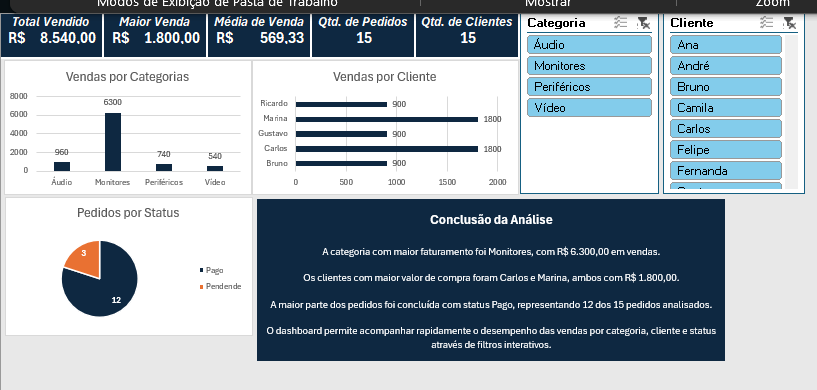

# Dashboard de Limpeza e Análise de Dados no Excel

Este projeto apresenta um dashboard desenvolvido no Microsoft Excel com foco em limpeza, padronização e análise de dados de vendas.

O objetivo foi transformar uma base de dados inconsistente em informações organizadas e visuais para apoio à análise comercial.

## Etapas realizadas

- Limpeza de dados
- Padronização de categorias
- Correção de valores inválidos
- Tratamento de duplicidades
- Organização da base
- Criação de tabelas dinâmicas
- Desenvolvimento de gráficos
- Segmentação de dados
- Construção de dashboard analítico

## Dashboard

## Indicadores apresentados

- Total Vendido
- Maior Venda
- Média de Venda
- Quantidade de Pedidos
- Quantidade de Clientes

## Análises realizadas

- Vendas por Categoria
- Vendas por Cliente
- Pedidos por Status
- Comparação de faturamento
- Identificação dos principais clientes

## Ferramentas utilizadas

- Microsoft Excel
- Fórmulas
- Tabelas Dinâmicas
- Segmentação de Dados
- Limpeza de Dados
- Formatação Condicional
- Dashboard Executivo

## Conclusão

A análise mostrou que a categoria Monitores apresentou o maior faturamento, totalizando R$ 6.300,00.

Os clientes com maior valor de compra foram Carlos e Marina, ambos com R$ 1.800,00 em vendas.

Também foi possível identificar que a maior parte dos pedidos foi concluída com status Pago, representando 12 dos 15 pedidos analisados.

O dashboard permite acompanhar rapidamente o desempenho das vendas através de filtros interativos por categoria e cliente.

## Arquivo do projeto

O arquivo Excel está disponível neste repositório:

`dashboard-limpeza-dados.xlsx`
